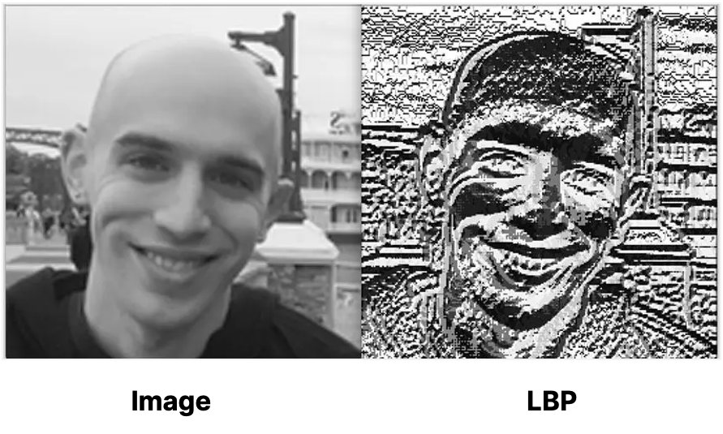

# Basic Face Recognition in Videos Using OpenCV

### A CLI program which can be used to find a specific person in a video footage

Archived project from 2016 HARVARD CS50
 

 
<b>A.</b>&nbsp;To recognize? Liv Tyler (Arwen) in LOTR 
<b>B.</b>&nbsp;To recognize? Obama during a speech 
 
<b>source:&nbsp;&nbsp;</b>movieclips by rotten tomatoes - youtube.com, whitehouse.gov

💡🗒️ **Note to Self:** 

📋 📐🔨 *some time in the future:*
- Modify this program to output all the timpstamps where the target person was found in the vidoe footage
- Another project that demonstrates more sophisticated face recognition techniques
- Another project that demonstrates how face recognition algorithms can be thwarted (to preserve anonymity)

## Objective 
*From 2016*

Face detection can be found in a variety of applications, perhaps, most noticeably in digital and phone cameras. Today's cameras detect all faces in the image and auto-focus automatically to allow for the best possible overall picture.

Face recognition, on the other hand, is not as common. Not too long ago, after detecting all faces in an uploaded image, Facebook would ask the user to tag their friends in it. Today's Facebook can automatically do that. Upload a picture of your friends and Facebook would not only detect faces in that picture but also recognize the friends those faces belong to! The application of face recognition does not end here. 

There is an exciting potential for face recognition in the emerging field of social robotics. Household robots like Jibo can recognize members of the family. Through machine learning, Jibo can get better at recognizing people the more it sees them. It can watch out for intruders and look after your kids. Overtime, it can learn unique things about individual family members it interacts with. The possibilities are endless. 

 
<b>source:&nbsp;&nbsp;</b>hackaday.com, technabob.com

While we can’t all be as cool as Jibo who’s had plenty of time to learn and is most likely using proprietary face recognition techniques beyond the scope of this project, our aim is to demonstrates how *basic* face recognition—somewhat inaccurate as it may be—can be achieved using *open-source computer vision* (OpenCV).

*2020 update on Jibo:* [Jibo, the social robot that was supposed to die, is getting a second life](https://www.theverge.com/2020/7/23/21325644/jibo-social-robot-ntt-disruptionfunding)

<!--Note: the videos in the videos-output directory should be seen before reading any further.-->

## Theoretical Gist

#### Face Detection
OpenCV provides Haar and Local Binary Patterns (LBP) feature-based classifiers for object detection. In this project, the object or the Region of Interest (ROI) in images is a face. Therefore, pre-trained classifiers are used for detecting faces. Faces can be detected in images since all faces have common features, such as, forehead, eyes, nose, mouth, chin etc.

For more information, check out [this writeup](https://scribe.rip/analytics-vidhya/what-is-haar-features-used-in-face-detection-a7e531c8332b).
For a more in-depth look at how Haar classification works, see [this paper](https://www.cs.cmu.edu/~efros/courses/LBMV07/Papers/viola-cvpr-01.pdf).

Compared to Haar, LBP classifiers provide better performance with some loss of accuracy. This compromise is acceptable in our case since performance is more important when processing video frames.

#### Face Recognition
Face recognition goes one step further, or several, to identify the person a detected face belongs to. Recognizing the face of a specific person can be quite difficult due to the large amount of image pre-processing involved. OpenCV currently offers the following approaches to achieve face recognition:

- Eigenfaces
- Fisherfaces
- Local Binary Patterns Histograms (LBPHs)
    
These methods attempt to recognize a face by comparing it with a training set of known faces. The recognizer algorithm for each method is provided with a set of faces and trained to associate them with a name. When an unknown face is provided, the algorithm uses the training set of the known faces to make a prediction. Each method, however, uses the training set a bit differently. 

Eigenfaces and Fisherfaces treat images as vectors and perform a Principal Components Analysis (PCA) to obtain the eigenvectors comprising the basis of the vector image space. They use this descriptor to identify the most dominant features of the subject's faces in the whole training set. LBPHs, on the other hand, independently analyse each face in the training set by distinguishing the local patterns in each position in the image.

 
<b>source:&nbsp;&nbsp;</b>pyimagesearch.com

LPBHs are simpler to train images with, and provide better results for images with different lighting conditions and environments. To extract LBP facial features,

1. Facial image is divided into several non-overlapping blocks
2. LBP histograms are computed for each block
3. LBP histograms are concatenated into a single vector 

The image is represented by the LBP code. Refer to [this writeup](https://github.com/kelvins/lbph#readme) to know more about LBPHs.

## Requirements

The project uses the Open-Source Computer Vision (OpenCV) library for face detection and recognition and is implemented using Python. It requires OpenCV's pre-trained Haar and LBP Cascade Classifiers for detecting front-faces. These are loaded in the program as xml files. At least ten different images of a subject's face are required in the training set to perform a basic, low-certainty recognition. 

Additionally, video files, containing the subject to be recognized, are required to test the program. For this basic face recognition program, the video where a known person has to be found must contain at least one frame where this person is directly looking at the camera.

## Constraints

Only front faces can be recognized since the face detecting cascade classifiers have been trained to identify front faces accurately. The LBPH recognizer has not been trained to associate frontal view of a subject's face to the side-view of the same subject's face. 

Furthermore, the recognizer cannot be trained on more than one subject at a time due to loss of accuracy. Consequently, only one subject can be recognized at a time amongst other people in a video containing that subject. 

Lastly, the recognition process is constrained by the certainty value or the confidence of the prediction. The user is required to specify the maximum confidence value when running the program. A lower confidence value indicates greater certainty in the prediction of a subject's face. If this max_conf value is too low, the subject's face may seldom be recognized. On the other hand, too high a max_conf value and the subject's face will be incorrectly recognized as other faces in the video. The max_conf value should be tweaked for each input video in which a given person is to be recognized.

## Code Structure

The code consists of two files: main.py and recognizer.py. 

main.py is the starting point of the program and handles user-input. Command-line arguments allow for quick execution of the program while offering flexibility of choice at the same time. Each argument is properly handled with useful feedback to the user before program execution can proceed any further.

recognizer.py houses dedicated functions for performing core program functionality. By having a separate recognizer module, the core functionality is abstracted away from the main module. At the same time, it allows for both modules to grow with more features for future enhancements.

Note that this structure can be improved by making it more *pythonic*. 
   

## Classifier Choice

The choice of classifier for detecting faces depends on the trade-off between accuracy and speed. The Haar cascade is more accurate than the LBP cascade out-of-the-box. However, the latter allows for faster detection of faces which can be important in video streams. LBP cascade is used since the resulting performance gain is significant while loss of accuracy is minimal.

LBPH was chosen as the recognizer due to its simplicity. It can distinguish between each image in the training set locally rather than having to consider the whole training set for identifying dominant features. When attempting to perform a prediction on an unknown image, LBPH only does the same analysis every time for characterizing images by performing a comparison with the existing training set of a subject. LBPH also offers better results for training images with different lighting conditions and environments.
    

## Some Optimizations

When detecting faces in training images or in video streams, each image or frame is converted to grayscale for efficiency since colored images are not required for detecting facial features. For training, numpy package is used to handle computations efficiently.

## Run the program

#### Step 0: Check out a sample output

Before running the program, you can get a sense of the result by downloading and playing the two output videos already present in the videos-out directory.

#### Step 1: Install OpenCV

Linux users can execute the following installation script included in the project directory:
   
`sudo bash install-opencv.sh`
> this may have to be tweaked, e.g., for the latest opencv version

Other users can refer to [OpenCV's official installation](https://opencv.org/get-started/) for Python.

#### Step 2: Understand the project structure

This is what the existing project directory tree looks like:

. 
| -- figures 
| -- recognizer 
| &nbsp;&nbsp; | -- classifiers 
| &nbsp;&nbsp; | -- training-set 
| &nbsp;&nbsp; | &nbsp;&nbsp; | -- livtyler 
| &nbsp;&nbsp; | &nbsp;&nbsp; | -- obama 
| &nbsp;&nbsp; | -- videos-input 
| &nbsp;&nbsp; | -- videos-output  
| &nbsp;&nbsp; | -- main.py 
| &nbsp;&nbsp; | -- recognizer.py 
| -- install-opencv.sh 
| -- LICENSE 
| -- README.md 
| -- External Libraries

**Note:**
1. The name of the python project is "recognizer". 

2. The classifiers directory contains two choices of classifiers for face detection.

3. The training-set directory contains two sub-directories containing images of certain people to use for training the LBPH recognizer. Ideally, the training set should contain plenty of images of the person to improve training quality and recognition accuracy. Due to their sheer abundance, images of politicians and actors lend themselves well for this task. Hence, image sets of Barack Obama and Liv Tyler for starters.

4. The videos-input directory contains videos that the code will read and process frame-by-frame to try to recognize faces it's been trained to recognize. It contains two videos already; a clip of the nazgul chase scene from Lord of the Rings and a clip of President Obama giving a speech on immigration reforms. Note that since we are only doing video processing, you will not hear any audio. These videos are also edited to show those scenes where the subject, President Obama or Liv Tyler, is directly facing the front since we can only achieve front face recognition with the program for now. To the computer, a side-pose of a person is a completely different person! There is some room for partial angles with the current approach but it would require making a custom classifier.

5. The videos-out directory contains videos that are written by the program after processing and marking the input videos with faces. Unfamiliar faces will be marked in red and familiar faces in green with the person's name identified.

6. main.py is the starting point of the program. It contains a main method for processing command-line arguments and calling methods in the recognizer.py module for training and processing.

7. recognizer.py is a module that contains methods for the core functionality of the project.

8. install-opencv.sh is a shell script for installing opencv.

9. External Libraries may contain some that weren't used eventually by the project.
    
#### Step 3: Safety first

- Do not change the name of any existing directory as the program searches in specific directories for training image sets and videos.
- To add a training image set of some other person, say Maria, simply add a folder named 'maria' to the training set directory. Be sure to stuff it with as many images as possible where the face is facing the front. Also, crop the image so that it only shows the face. This would avoid any false positives when the face detection classifier looks at the images to learn the face.

#### Step 4: Test the program

Assuming OpenCV is correctly installed and the project does not show any dependency errors, let's try running it.

From inside the `recognizer` dir, execute the following command:

`python main.py 'livtyler' 59.0 'lotr-nazgul-chase-4.mp4'`
 
where 'livtyler' is the name of the subject we wish to recognize in the video file 'lotr-nazgul-chase-4.mp4’ with a maximum confidence value of 59.0. This max_conf value can be thought of as indicating the certainty range of the prediction of the faces. A confidence value of 0.0 indicates 100% certainty. A maximum confidence value of 59.0 means that any face predicted with a confidence value between 0.0 and 59.0 will be deemed as the subject's face. Too low a max_conf value and we might not recognize the subject. Too high a max_conf value and we will incorrectly recognize other faces in the video as being the subject's face. The max_conf value must be tweaked for each input video in which a given person is to be recognized.
    
Sit back and let the program perform the training and play the video.

Now execute the following command:
    
`python main.py 'obama' 50.0 'obama-speech-4.mp4'`
    
You man notice in Step 4 that for short instances, certain individuals may be incorrectly recognized as the subject. To remedy this condition, both improving the quality of the subject's training image set and lowering the max_conf value will be helpful.
   
You can make your own training image sets if you like and run on different input videos.

Have fun! :)

## Improvements

The project with its existing face recognition approach can be made more useful by doing a fame-by-frame analysis of the output videos with the predicted confidence value. A graph could be outputted simultaneously with the video to show how a frame with a familiar face facing front corresponds to a peak in prediction certainty.

Ultimately, latest research results from Facebooks DeepFace and Google's FaceNet projects can be used for inspiration. OpenFace is one project that has made available an open-source version of DeepFace. It makes use of deep and convolutional neural networks rather than OpenCV's classical approaches. Face Landmark Estimation Algorithms used in conjunction are able to recognize a face using as little as 128 measurements. All this not only allows for warping the face image to center the eyes and mouth for pose detection but speeds up the whole face recognition process to a few milliseconds.
